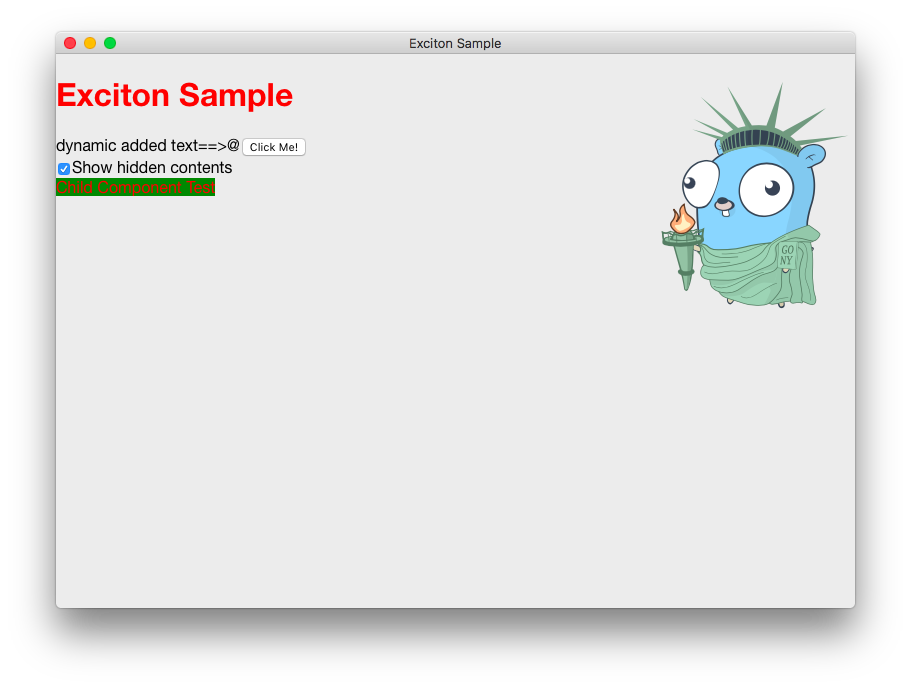

Exciton
====

Tiny webbrowser based cross-platform GUI library for Go.

It uses WKWebView on macOS, MSHTML (IE11) on Windows.
Linux is not yet implemented.

<p align="center">

## Caution

**Exciton is currently developing furiously. *NO documents*, *NO tests*, and *LESS api*. API compatibility is not guaranteed.**

The Windows driver is an experimental implementation.

## Requirement

go >= 1.09 (1.10 recomended)

### macOS
To build macOS binaries, you need to build in macOS environment.

The xcode(sdk >= 10.12) environment and clang are required for build.

```bash
xcode-select --install
```

### windows
To build windows binaries, you need to install mingw-w64 environment.

## Getting started

Install Exciton library with `go get`:

```bash
$ go get github.com/yossoy/exciton
```

Import the package and start using it:

main.go:
```go
package main

import "github.com/yossoy/exciton"
import 	_ "github.com/yossoy/exciton/driver/mac" // macOS driver

func onAppStart(app *exciton.App) {
    /* ... */
}

func main() {
    exciton.Run(onAppStart)
}
```

However, we recommend separating the file to import the platform driver from the main file.

main.go:
```go
package main

import "github.com/yossoy/exciton"

func onAppStart(app *exciton.App) {
    /* ... */
}

func main() {
    exciton.Run(onAppStart)
}
```

main_darwin.go:
```go
package main

import (
	_ "github.com/yossoy/exciton/driver/mac"
)
```
main_windows.go:
```go
package main

import (
	_ "github.com/yossoy/exciton/driver/windows"
)
```

## exciton-tool
NO document.